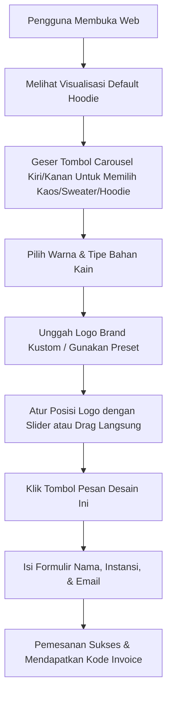

# Product Requirement Document (PRD)
## FitCraft 3D - Minimalist Customization Studio (Edisi Light)

---

## 1. PENDAHULUAN & LATAR BELAKANG
**FitCraft 3D** adalah platform visualisasi kustomisasi pakaian 3D berbasis web yang dirancang khusus untuk startup inovatif. Aplikasi ini bertujuan mengatasi keterbatasan pemesanan pakaian kustom tradisional yang sering kali tidak memiliki visualisasi presisi sebelum diproduksi. Edisi Light ini menghadirkan antarmuka minimalis modern, interaktif, dan performa tinggi bagi pengguna untuk merancang kaos, hoodie, dan sweater secara langsung di browser tanpa perlu menginstal aplikasi pihak ketiga.

---

## 2. SPESIFIKASI TARGET PENGGUNA (PERSONA)
* **Startup / Instansi**: Tim kreatif yang ingin memesan merchandise resmi berkualitas tinggi dengan pratinjau instan.
* **Panitia Acara / Event Organizer**: Pengguna yang membutuhkan kustomisasi cepat untuk seragam kepanitiaan dengan logo acara.
* **Juror Lomba (Target Khusus)**: Penilai yang mencari inovasi desain antarmuka yang bersih (*clean*), performa visual 3D yang lancar (min. 60 FPS), dan alur transaksi (*UX*) yang intuitif.

---

## 3. KEBUTUHAN FUNGSIONAL (FUNCTIONAL REQUIREMENTS)

### A. Fitur Visualisasi 3D Real-Time (Core 3D Viewport)
* **Rendering PBR (Physics-Based Rendering)**: Visualizer harus mereproduksi efek pencahayaan realistis pada serat kain baju.
* **Navigasi Orbit Kamera**: Pengguna dapat memutar pakaian 360 derajat secara horizontal/vertikal (klik-kiri + geser mouse) dan memperbesar/memperkecil detail (scroll mouse).
* **Reset & Zoom Cepat**: Tombol kontrol untuk mengatur ulang kamera ke posisi depan default (`Reset View`) atau melakukan zoom dekat ke permukaan kain (`Scale View`).
* **Unduh Gambar Desain (PNG)**: Tombol aksi (`Unduh PNG`) untuk menangkap frame render 3D dari kanvas dan mengunduhnya sebagai file gambar PNG transparan berkualitas tinggi.
* **Kontrol Rotasi Otomatis**: Toggle sakelar ON/OFF untuk memutar model pakaian secara pasif.
* **Preset Pencahayaan (Lighting)**: Opsi mengubah tipe lampu ke **Studio** (cahaya putih terang), **Sunset** (cahaya sore keemasan-oranye), atau **Industri** (cahaya neon futuristik biru-sian).

### B. Pemilihan Model Pakaian (Nike Style Carousel)
* **Navigasi Carousel**: Menampilkan tombol panah Kiri (`<`) dan Kanan (`>`) yang mengapit nama baju terpilih di sidebar.
* **3 Model Dasar**:
  1. *Hoodie Kustom Cozy* (Kategori: Outerwear, Harga Dasar: Rp 349.000, tipe 3D: `hoodie`).
  2. *Kaos Kinerja Pas Badan* (Kategori: Atasan, Harga Dasar: Rp 199.000, tipe 3D: `tshirt`).
  3. *Sweater Crewneck Klasik* (Kategori: Outerwear, Harga Dasar: Rp 299.000, tipe 3D: `sweater`).
* **Minimalis Tanpa Teks Panjang**: Carousel hanya menampilkan nama model, kategori, dan harga dasar tanpa teks penjelasan, berfokus penuh pada estetika visual produk.

### C. Kustomisasi Bahan & Warna (Material & Color Styling)
* **Jenis Bahan**:
  * *Katun Premium* (Default, Tekstur matte rajutan katun organik 100%, +Rp 0).
  * *Fleece Tebal* (Tekstur fleece tebal, halus, dan hangat, +Rp 75.000).
* **Pewarnaan Multi-Bagian (Multi-Zone Coloring)**:
  * Membagi pewarnaan pakaian menjadi 3 zona terpisah: **Badan** (tubuh utama, kupluk, saku), **Lengan** (kedua sleeves dan manset), dan **Detail** (kerah rib dan tali hoodie).
* **Pemilih Warna**:
  * 8 Preset Warna Tren (Tech Navy, Eco Sage, Khaki Zaitun, Creative Coral, Premium Burgundy, Aesthetic Cream, Heather Grey, Obsidian Black).
  * Input HEX manual untuk fleksibilitas warna kustom untuk zona terpilih.
  * *Recent Custom Colors*: Menampilkan maksimal 4 warna kustom yang baru saja diracik oleh pengguna.

### D. Kustomisasi Logo & Branding (Decals & Printing)
* **Preset Logo**: Menyediakan 4 template logo startup (FitCraft, Nexus AI, Quantum, Apex Tech) yang warnanya otomatis beradaptasi dengan warna dasar baju.
* **Unggah Gambar Kustom**: Fitur upload file gambar (PNG/JPG/WEBP) dengan dukungan drag-and-drop.
* **Manipulasi Logo 3D**:
  * Mengatur ukuran logo (Scale).
  * Mengatur posisi Vertikal (Y) & Horizontal (X).
  * Mengatur kepekatan/transparansi logo (Opacity).
  * **Interactive Dragging**: Pengguna dapat mengeklik dan menggeser langsung posisi logo pada permukaan baju 3D menggunakan kursor mouse.

### E. Perhitungan Harga & Alur Checkout (Order Management)
* **Kalkulasi Dinamis**: Total Harga = Harga Model Terpilih + Tambahan Harga Bahan Premium (Fleece).
* **Checkout Modal**: Menampilkan pop-up ringkasan desain (Model baju, spesifikasi bahan, skema warna, jenis logo, dan harga akhir).
* **Formulir Pembelian**: Input Nama Lengkap, Nama Startup/Instansi, dan Alamat Email.
* **Success Overlay**: Menampilkan tanda sukses transaksi dengan kode pesanan unik setelah menekan konfirmasi bayar.

---

## 4. KEBUTUHAN NON-FUNGSIONAL (NON-FUNCTIONAL REQUIREMENTS)
* **Performa Rendering**: Engine 3D Three.js harus berjalan lancar dengan minimal 50-60 FPS pada perangkat laptop standar dengan konsumsi resource memori rendah.
* **Desain Glassmorphism**: Antarmuka sidebar menggunakan konsep transparansi blur (*backdrop-filter*) yang kontras dengan latar belakang gradasi dinamis.
* **Mobile Responsiveness**: Tampilan web harus beradaptasi dengan rapi ketika dibuka melalui layar smartphone (mengubah layout sidebar menjadi di bawah kanvas 3D).
* **Localization**: Seluruh teks antarmuka menggunakan Bahasa Indonesia yang profesional dan komunikatif.

---

## 5. ALUR PENGGUNA (USER FLOW)

---

## 6. TEKNOLOGI PENGEMBANGAN (TECH STACK)
* **Struktur Halaman**: HTML5 dengan tag semantik.
* **Desain UI/UX**: CSS3 Modern (Vanilla CSS) dengan Variabel HSL untuk kemudahan tema warna gelap/terang.
* **Engine Grafis 3D**: Three.js & OrbitControls (Web GL API) via CDN.
* **Logika Aplikasi**: Vanilla Javascript ES6 modular tanpa framework eksternal.

---

## 7. ROADMAP INOVASI MASA DEPAN
* **Penyimpanan Galeri & Tautan Berbagi (Design Save & Share)**: Menambahkan fitur ekspor konfigurasi desain sebagai teks JSON atau menyimpannya di cloud. Pengguna dapat menghasilkan tautan unik (URL kustom) untuk membagikan hasil kustomisasi ke jejaring sosial agar dapat dimodifikasi oleh rekan tim lain.
* **Coba Virtual berbasis AR (WebXR Augmented Reality)**: Memproyeksikan visualisasi model 3D baju ke permukaan dunia nyata secara langsung menggunakan kamera HP.
