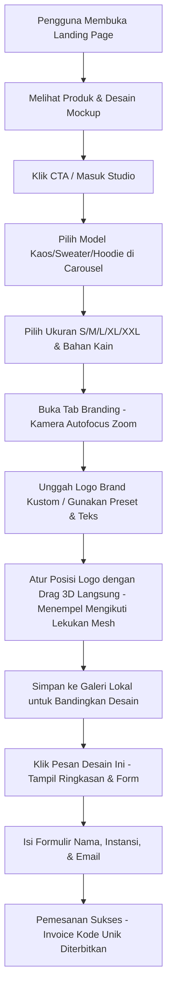

# Product Requirement Document (PRD)
## FitCraft 3D - Real-Time 3D Customization Studio (Vite + React Edition)

---

## 1. PENDAHULUAN & LATAR BELAKANG
**FitCraft 3D** adalah platform visualisasi kustomisasi pakaian 3D berbasis web yang dirancang khusus untuk startup inovatif. Aplikasi ini menghadirkan antarmuka minimalis modern, interaktivitas tinggi, dan performa rendering visual 3D yang lancar langsung di browser tanpa perlu menginstal aplikasi pihak ketiga. 

Edisi Premium ini mengadopsi arsitektur **Vite + React (JavaScript)** yang modular, memisahkan halaman perkenalan produk (*Landing Page*) dengan ruang kerja desain (*3D Customizer Studio*) menggunakan router berbasis state untuk performa optimal dan estetika premium sekelas kompetisi desain web modern (Awwwards-quality).

---

## 2. SPESIFIKASI TARGET PENGGUNA (PERSONA)
* **Startup / Instansi**: Tim kreatif yang ingin memesan merchandise resmi berkualitas tinggi dengan pratinjau instan.
* **Panitia Acara / Event Organizer**: Pengguna yang membutuhkan kustomisasi cepat untuk seragam kepanitiaan dengan logo acara.
* **Juror Lomba (Target Khusus)**: Penilai yang mencari inovasi desain antarmuka yang bersih (*clean*), performa visual 3D yang lancar (min. 60 FPS), animasi mikro yang mewah, dan alur kustomisasi yang intuitif.

---

## 3. ARSITEKTUR HALAMAN (REACT SPA ARCHITECTURE)
Aplikasi ini dikembangkan sebagai React Single-Page Application (SPA) berbasis Vite dengan komponen utama berikut:
1. **Global Splash Screen / Preloader (`App.jsx`)**:
   * Tirai pemuatan penuh (*fullscreen preloader curtain*) yang bertindak sebagai gerbang masuk teaterikal.
   * Menampilkan logo & indikator progress berupa animasi *text-fill* bermerek "FITCRAFT 3D" yang diisi warna secara real-time.
2. **Landing Page Component (`LandingPage.jsx`)**:
   * Desain gelap obsidian bertema premium/luxurious.
   * Efek interaksi premium: scroll reveal (Intersection Observer) dan navigasi landing page yang mulus.
   * Pratinjau hoodie interaktif berbasis SVG swatches (mengubah warna mockup SVG secara real-time).
   * Form login mockup terintegrasi dengan penyimpanan sesi lokal.
3. **Products Catalog Component (`ProductsPage.jsx`)**:
   * Katalog 3 model pakaian dasar (Hoodie, Kaos, Sweater) dengan spesifikasi lengkap.
   * Efek interaksi kartu glassmorphism dengan spotlight glow yang mengikuti pergerakan kursor mouse.
4. **3D Customizer Studio Component (`StudioPage.jsx` + `StudioVisualizer.jsx`)**:
   * Workspace Three.js full-screen berdampingan dengan sidebar konfigurasi bertema glassmorphism transparan.
   * Visualisasi interaktif terfokus penuh pada kanvas 3D tanpa pratinjau 2D flat untuk menjamin pengalaman editor 3D yang modern dan imersif.
   * Tempat utama untuk merancang, mengunggah logo, mengatur ukuran, menyimpan galeri lokal, dan melakukan checkout simulasi.

---

## 4. KEBUTUHAN FUNGSIONAL (FUNCTIONAL REQUIREMENTS)

### A. Fitur Visualisasi 3D Real-Time (Core 3D Viewport)
* **Rendering PBR (Physics-Based Rendering)**: Visualizer mereproduksi efek pencahayaan realistis pada serat kain baju menggunakan model GLB berkualitas tinggi.
* **Pemuatan Model GLB Asinkron**: 
  * Memuat file model 3D kaos (`black t shirt 3d model.glb`), hoodie (`black hoodie 3d model.glb`), dan sweater (`knitted crewneck sweater 3d model.glb`) secara dinamis.
  * Menggunakan rotasi Y otomatis sebesar `-Math.PI / 2` agar semua model menghadap tegak lurus ke kamera.
  * Memiliki toleransi kegagalan (*fallback*) berupa model geometris prosedural apabila aset 3D gagal dimuat.
* **Navigasi Orbit Kamera**: Pengguna dapat memutar pakaian 360 derajat secara horizontal/vertikal (klik-kiri + geser mouse) dan memperbesar/memperkecil detail (scroll mouse).
* **Reset & Zoom Cepat**: Tombol kontrol untuk mengatur ulang kamera ke posisi depan default (`Reset View`) atau melakukan zoom dekat ke permukaan kain (`Scale View` / Perbesar).
* **Jitter-Free Zoom**: Transisi perbesaran kamera yang mulus tanpa getaran kaku dengan mematikan kontrol input sementara dan melakukan *interpolasi lerp* pada titik fokus kamera (`controls.target`) sepanjang animasi.
* **Unduh Gambar Desain (PNG)**: Tombol aksi (`Unduh PNG`) untuk menangkap frame render 3D dari kanvas dan mengunduhnya sebagai file gambar PNG transparan berkualitas tinggi.
* **Kontrol Rotasi Otomatis**: Toggle sakelar ON/OFF untuk memutar model pakaian secara pasif.
* **Preset Pencahayaan (Lighting)**: Opsi mengubah tipe lampu ke **Studio** (cahaya putih terang), **Sunset** (cahaya sore keemasan-oranye), atau **Industri** (cahaya neon futuristik biru-sian).
* **Ground Contact Shadow**: Bayangan kontak melingkar lembut di bawah pakaian menggunakan CanvasTexture radial gradient untuk memberikan kedalaman visual dan menapakkan pakaian secara realistis.

### B. Pemilihan Model Pakaian & Ukuran (Silhouette & Sizing)
* **Carousel Model Selector**: Menampilkan tombol panah Kiri (`<`) dan Kanan (`>`) untuk memilih:
  1. *Hoodie Kustom Cozy* (Outerwear, Rp 349.000) - Memuat model GLB hoodie.
  2. *Kaos Kinerja Pas Badan* (Atasan, Rp 199.000) - Memuat model GLB kaos.
  3. *Sweater Crewneck Klasik* (Outerwear, Rp 299.000) - Memuat model GLB sweater.
* **Size Selector Pills (S, M, L, XL, XXL)**: Tombol pill interaktif di sidebar untuk mengubah ukuran baju.
* **3D Scale Animation**: Mengubah ukuran model 3D pakaian secara halus menggunakan animasi transisi skala (S = 0.92x, M = 1.0x, L = 1.08x, XL = 1.15x, XXL = 1.22x) demi umpan balik visual yang memuaskan.
* **Tabel Panduan Ukuran (Size Chart)**: Modal pop-up tabel dimensi pakaian (Lebar Dada x Panjang Badan x Panjang Lengan) dalam centimeter (cm) sebagai referensi fitting lokal.

### C. Kustomisasi Bahan & Warna (Material & Color Styling)
* **Jenis Bahan**:
  * *Katun Premium* (Default, Tekstur matte rajutan katun organik 100%, +Rp 0).
  * *Fleece Tebal* (Tekstur fleece tebal, halus, dan hangat, +Rp 75.000).
  * Tekstur ini digambar secara prosedural di `<canvas>` saat aplikasi dimuat untuk menjaga performa loading yang sangat ringan tanpa memerlukan aset eksternal.
* **Pewarnaan Seragam Pakaian (Uniform Clothing Coloring)**:
  * Menggunakan pemilih warna tunggal terpusat untuk mewarnai seluruh bagian pakaian (badan, lengan, dan detail) secara seragam dan konsisten.
  * *8 Preset Warna Tren*: Tech Navy, Eco Sage, Khaki Zaitun, Creative Coral, Premium Burgundy, Aesthetic Cream, Heather Grey, Obsidian Black.
  * Mendukung input HEX manual dan Color Picker kustom untuk fleksibilitas warna kustom.

### D. Kustomisasi Logo & Branding (Decals & Printing)
* **Preset Logo**: Menyediakan 4 template logo startup (FitCraft, Nexus AI, Quantum, Apex Tech) yang warnanya otomatis beradaptasi dengan warna dasar baju.
* **Unggah Gambar Kustom**: Fitur upload file gambar (PNG/JPG/WEBP) dengan dukungan drag-and-drop.
* **Gaya Teks Kustom**: Menginput teks kustom dengan pilihan font (Space Grotesk, Outfit, Playfair Display) dan warna teks kontras.
* **Manipulasi Logo 3D**:
  * Mengatur ukuran logo (Scale).
  * Mengatur posisi Vertikal (Y) & Horizontal (X).
  * Mengatur kepekatan/transparansi logo (Opacity).
  * **Interactive Dragging (Normal-Conformal Snapping)**: Pengguna dapat mengeklik dan menggeser langsung posisi logo pada permukaan baju 3D. Logo akan secara otomatis menempel pas mengikuti kelengkungan permukaan kain dan menghadap lurus sesuai arah normal permukaan mesh 3D.
  * **State Preservation**: Posisi stiker 3D tidak akan melompat kembali ke dada depan saat pengguna mengubah ukuran, warna, teks, atau transparansi logo.
* **Decal Selection Outline**: Garis bantu hijau sage (`decalOutline`) di sekeliling logo saat kursor di-hover atau di-drag untuk memberikan umpan balik desain yang presisi.
* **Camera Autofocus**: Sudut kamera secara otomatis bergeser dan melakukan zoom-in ke area dada saat pengguna membuka tab Branding & Logo untuk mempermudah penempatan logo, serta kembali ke posisi default saat berpindah tab.

### E. Galeri Desain & Checkout (Order Management)
* **Galeri Desain Lokal**: Pengguna dapat menyimpan varian desain mereka ke memori browser lokal (`localStorage`). Desain yang disimpan mencakup jenis baju, bahan, warna, ukuran baju, jenis decal, teks kustom, koordinat 3D stiker, dan gambar thumbnail.
* **Restorasi Desain**: Mengklik kartu desain di galeri akan memulihkan seluruh konfigurasi visual 3D, menyinkronkan tombol slider, dan mengaktifkan pill ukuran yang tepat.
* **Kalkulasi Dinamis**: Total Harga = Harga Model Terpilih + Tambahan Harga Bahan Premium (Fleece).
* **Checkout Modal & Success Overlay**: Pop-up konfirmasi ringkasan detail pesanan lengkap dengan input nama, email, instansi, dan penyerahan invoice kode pesanan setelah submit formulir.

### F. Sistem Splash Screen / Preloader Global & Transisi Pintu (Global Preloader & Slide-Up Reveal)
* **Durasi Minimum 4 Detik**: Preloader ditampilkan minimal selama 4 detik untuk memperkuat branding dan memastikan inisialisasi visual berjalan matang.
* **Sinkronisasi Progress & Aset**: Pemuatan disinkronkan langsung dengan progress unduhan model 3D (`onProgress` / `onReady`). Jika pemuatan membutuhkan waktu lebih dari 4 detik, preloader akan terus ditampilkan dan hanya akan membuka halaman setelah pemuatan model selesai sepenuhnya.
* **Animasi Text-Fill Logo & Evaporasi Teks**: Progress loader direpresentasikan oleh teks brand "FITCRAFT 3D" yang diisi warna secara bertahap dari 0% ke 95% menggunakan interpolasi `requestAnimationFrame`. Saat 100%, teks akan memudar keluar (`opacity: 0`) dan bergerak naik (`translateY(-40px)`) secara elegan.
* **Kunci Scroll Total & Anti-Shift**:
  * Mengunci scrollbar pada koordinat `y = 0` secara total selama pemuatan menggunakan kelas `loading-active` pada `html` dan `body` untuk mencegah "peeking" atau pemulihan posisi scroll browser yang tidak terduga.
  * Mempertahankan bar scrollbar (`overflow-y: scroll`) pada level root sepanjang daur hidup situs, mencegah geseran tata letak horizontal (*layout shift* kaku ke kiri) sewaktu scroll lock dilepas pasca transisi selesai.
  * Menonaktifkan semua interaksi kursor (`pointer-events: none`) di belakang layar selama proses pemuatan.
* **Transisi Geser ke Atas (Slide-up Curtain)**: Halaman utama (`.app-content-wrapper`) meluncur masuk dari bawah ke atas (`translateY(100vh) -> translateY(0)`) dengan kurva bezier melambat (*ease-out*) selama 0.8 detik setelah pemuatan usai.
* **Cross-fade Latar Belakang**: Latar belakang gradien radial gelap loader memudar secara gradual (`opacity: 1 -> 0`) selama 0.8 detik ketika status berganti ke `.loaded` untuk melebur dengan warna latar belakang obsidian asli milik landing page secara mulus tanpa kedipan warna yang kaku sewaktu loader di-unmount.

---

## 5. KEBUTUHAN NON-FUNGSIONAL (NON-FUNCTIONAL REQUIREMENTS)
* **WebGL Resource Cleanup**: Pembersihan (disposing) geometri, material, dan map tekstur lama saat model/logo diganti untuk mencegah penumpukan konsumsi RAM/GPU (memory leaks).
* **Performa Rendering**: Engine 3D Three.js harus berjalan lancar dengan minimal 50-60 FPS pada perangkat laptop standar.
* **Desain Glassmorphism**: Antarmuka sidebar menggunakan konsep transparansi blur (*backdrop-filter*) yang kontras dengan latar belakang gradasi dinamis.
* **Mobile Responsiveness**: Layout sidebar beradaptasi menjadi susunan di bawah kanvas 3D ketika dibuka melalui layar smartphone.
* **Localization**: Seluruh teks antarmuka menggunakan Bahasa Indonesia yang profesional dan komunikatif.

---

## 6. ALUR PENGGUNA (USER FLOW)

---

## 7. TEKNOLOGI PENGEMBANGAN (TECH STACK)
* **Runtime & Framework**: React 19 (React-DOM) + JavaScript.
* **Build Tool & Server**: Vite 8.
* **Desain UI/UX**: CSS3 Modern (Vanilla CSS) dengan Variabel HSL untuk kemudahan tema warna gelap/terang.
* **Engine Grafis 3D**: Three.js (`three` npm package) & OrbitControls.
* **Kualitas & Linter**: ESLint (Flat Config).
