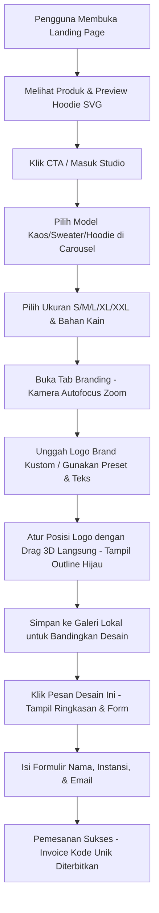

# Product Requirement Document (PRD)
## FitCraft 3D - Minimalist Customization Studio (Edisi Premium Dual-Page)

---

## 1. PENDAHULUAN & LATAR BELAKANG
**FitCraft 3D** adalah platform visualisasi kustomisasi pakaian 3D berbasis web yang dirancang khusus untuk startup inovatif. Aplikasi ini menghadirkan antarmuka minimalis modern, interaktivitas tinggi, dan performa rendering visual 3D yang lancar langsung di browser tanpa perlu menginstal aplikasi pihak ketiga. 

Edisi Premium ini mengadopsi **Arsitektur Dual-Page** yang memisahkan halaman perkenalan produk (*Landing Page*) dengan ruang kerja desain (*3D Customizer Studio*) untuk performa optimal dan estetika premium sekelas kompetisi desain web modern (Awwwards-quality).

---

## 2. SPESIFIKASI TARGET PENGGUNA (PERSONA)
* **Startup / Instansi**: Tim kreatif yang ingin memesan merchandise resmi berkualitas tinggi dengan pratinjau instan.
* **Panitia Acara / Event Organizer**: Pengguna yang membutuhkan kustomisasi cepat untuk seragam kepanitiaan dengan logo acara.
* **Juror Lomba (Target Khusus)**: Penilai yang mencari inovasi desain antarmuka yang bersih (*clean*), performa visual 3D yang lancar (min. 60 FPS), animasi mikro yang mewah, dan alur kustomisasi yang intuitif.

---

## 3. ARSITEKTUR HALAMAN (DUAL-PAGE ARCHITECTURE)
Aplikasi terbagi menjadi dua halaman fisik terpisah untuk optimalisasi beban resource:
1. **Landing Page (`index.html` + `landing.css` + `landing.js`)**:
   * Desain gelap obsidian bertema premium/luxurious.
   * Animasi latar belakang gradasi mesh berdenyut.
   * Efek interaksi premium: tombol magnetik (*magnetic CTA*), efek scroll reveal, dan navigasi smooth scroll anchor.
   * Pratinjau hoodie interaktif berbasis SVG swatches (mengubah warna mockup SVG secara real-time).
   * Form login mockup terintegrasi dengan penyimpanan sesi lokal.
2. **3D Customizer Studio (`studio.html` + `index.css` + `app.js` + `ui.js`)**:
   * Workspace Three.js full-screen berdampingan dengan sidebar konfigurasi bertema glassmorphism transparan.
   * Tempat utama untuk merancang, mengunggah logo, mengatur ukuran, menyimpan galeri lokal, dan melakukan checkout simulasi.

---

## 4. KEBUTUHAN FUNGSIONAL (FUNCTIONAL REQUIREMENTS)

### A. Fitur Visualisasi 3D Real-Time (Core 3D Viewport)
* **Rendering PBR (Physics-Based Rendering)**: Visualizer mereproduksi efek pencahayaan realistis pada serat kain baju.
* **Navigasi Orbit Kamera**: Pengguna dapat memutar pakaian 360 derajat secara horizontal/vertikal (klik-kiri + geser mouse) dan memperbesar/memperkecil detail (scroll mouse).
* **Reset & Zoom Cepat**: Tombol kontrol untuk mengatur ulang kamera ke posisi depan default (`Reset View`) atau melakukan zoom dekat ke permukaan kain (`Scale View` / Perbesar).
* **Jitter-Free Zoom**: Transisi perbesaran kamera yang mulus tanpa getaran kaku dengan mematikan kontrol input sementara dan melakukan *interpolasi lerp* pada titik fokus kamera (`controls.target`) sepanjang animasi.
* **Unduh Gambar Desain (PNG)**: Tombol aksi (`Unduh PNG`) untuk menangkap frame render 3D dari kanvas dan mengunduhnya sebagai file gambar PNG transparan berkualitas tinggi.
* **Kontrol Rotasi Otomatis**: Toggle sakelar ON/OFF untuk memutar model pakaian secara pasif.
* **Preset Pencahayaan (Lighting)**: Opsi mengubah tipe lampu ke **Studio** (cahaya putih terang), **Sunset** (cahaya sore keemasan-oranye), atau **Industri** (cahaya neon futuristik biru-sian).
* **Ground Contact Shadow**: Bayangan kontak melingkar lembut di bawah pakaian menggunakan CanvasTexture radial gradient untuk memberikan kedalaman visual dan menapakkan pakaian secara realistis.

### B. Pemilihan Model Pakaian & Ukuran (Silhouette & Sizing)
* **Carousel Model Selector**: Menampilkan tombol panah Kiri (`<`) dan Kanan (`>`) untuk memilih:
  1. *Hoodie Kustom Cozy* (Kategori: Outerwear, Harga Dasar: Rp 349.000).
  2. *Kaos Kinerja Pas Badan* (Kategori: Atasan, Harga Dasar: Rp 199.000).
  3. *Sweater Crewneck Klasik* (Kategori: Outerwear, Harga Dasar: Rp 299.000).
* **Size Selector Pills (S, M, L, XL, XXL)**: Tombol pill interaktif di sidebar untuk mengubah ukuran baju.
* **3D Scale Animation**: Mengubah ukuran model 3D pakaian secara halus menggunakan animasi transisi skala (S = 0.92x, M = 1.0x, L = 1.08x, XL = 1.15x, XXL = 1.22x) demi umpan balik visual yang memuaskan.
* **Tabel Panduan Ukuran (Size Chart)**: Modal pop-up tabel dimensi pakaian (Lebar Dada x Panjang Badan x Panjang Lengan) dalam centimeter (cm) sebagai referensi fitting lokal.

### C. Kustomisasi Bahan & Warna (Material & Color Styling)
* **Jenis Bahan**:
  * *Katun Premium* (Default, Tekstur matte rajutan katun organik 100%, +Rp 0).
  * *Fleece Tebal* (Tekstur fleece tebal, halus, dan hangat, +Rp 75.000).
* **Pewarnaan Multi-Bagian (Multi-Zone Coloring)**:
  * Membagi pewarnaan pakaian menjadi 3 zona terpisah: **Badan** (tubuh utama, kupluk, saku), **Lengan** (kedua sleeves dan manset), dan **Detail** (kerah rib dan tali hoodie).
* **Pemilih Warna**:
  * 8 Preset Warna Tren (Tech Navy, Eco Sage, Khaki Zaitun, Creative Coral, Premium Burgundy, Aesthetic Cream, Heather Grey, Obsidian Black).
  * Input HEX manual dan Color Picker kustom untuk fleksibilitas warna kustom.
  * *Recent Custom Colors*: Menampilkan maksimal 4 warna kustom yang baru saja diracik oleh pengguna.

### D. Kustomisasi Logo & Branding (Decals & Printing)
* **Preset Logo**: Menyediakan 4 template logo startup (FitCraft, Nexus AI, Quantum, Apex Tech) yang warnanya otomatis beradaptasi dengan warna dasar baju.
* **Unggah Gambar Kustom**: Fitur upload file gambar (PNG/JPG/WEBP) dengan dukungan drag-and-drop.
* **Gaya Teks Kustom**: Menginput teks kustom dengan pilihan font (Space Grotesk, Outfit, Playfair Display) dan warna teks kontras.
* **Manipulasi Logo 3D**:
  * Mengatur ukuran logo (Scale).
  * Mengatur posisi Vertikal (Y) & Horizontal (X).
  * Mengatur kepekatan/transparansi logo (Opacity).
  * **Interactive Dragging**: Pengguna dapat mengeklik dan menggeser langsung posisi logo pada permukaan baju 3D menggunakan kursor mouse.
* **Decal Selection Outline**: Garis bantu hijau sage (`decalOutline`) di sekeliling logo saat kursor di-hover atau di-drag untuk memberikan umpan balik desain yang presisi.
* **Camera Autofocus**: Sudut kamera secara otomatis bergeser dan melakukan zoom-in ke area dada saat pengguna membuka tab Branding & Logo untuk mempermudah penempatan logo, serta kembali ke posisi default saat berpindah tab.

### E. Galeri Desain & Checkout (Order Management)
* **Galeri Desain Lokal**: Pengguna dapat menyimpan varian desain mereka ke memori browser lokal (`localStorage`). Desain yang disimpan mencakup jenis baju, bahan, warna tiap zona, ukuran baju, jenis decal, teks kustom, koordinat modifikasi, dan gambar thumbnail.
* **Restorasi Desain**: Mengklik kartu desain di galeri akan memulihkan seluruh konfigurasi visual 3D, menyinkronkan tombol slider, dan mengaktifkan pill ukuran yang tepat.
* **Kalkulasi Dinamis**: Total Harga = Harga Model Terpilih + Tambahan Harga Bahan Premium (Fleece).
* **Checkout Modal & Success Overlay**: Pop-up konfirmasi ringkasan detail pesanan lengkap dengan input nama, email, instansi, dan penyerahan invoice kode pesanan setelah submit formulir.

---

## 5. KEBUTUHAN NON-FUNGSIONAL (NON-FUNCTIONAL REQUIREMENTS)
* **WebGL Resource Cleanup**: Pembersihan (disposing) geometri, material, dan map tekstur lama saat model/logo diganti untuk mencegah penumpukan konsumsi RAM/GPU (memory leaks).
* **Performa Rendering**: Engine 3D Three.js harus berjalan lancar dengan minimal 50-60 FPS pada perangkat laptop standar.
* **Desain Glassmorphism**: Antarmuka sidebar menggunakan konsep transparansi blur (*backdrop-filter*) yang kontras dengan latar belakang gradasi dinamis.
* **Mobile Responsiveness**: Layout sidebar beradaptasi menjadi susunan di bawah kanvas 3D ketika dibuka melalui layar smartphone.
* **Localization**: Seluruh teks antarmuka menggunakan Bahasa Indonesia yang profesional dan komunikatif.

---

## 6. ALUR PENGGUNA (USER FLOW)

---

## 7. TEKNOLOGI PENGEMBANGAN (TECH STACK)
* **Struktur Halaman**: HTML5 dengan tag semantik.
* **Desain UI/UX**: CSS3 Modern (Vanilla CSS) dengan Variabel HSL untuk kemudahan tema warna gelap/terang.
* **Engine Grafis 3D**: Three.js & OrbitControls (WebGL API) via CDN.
* **Logika Halaman**: Vanilla Javascript ES6 modular tanpa framework eksternal.
